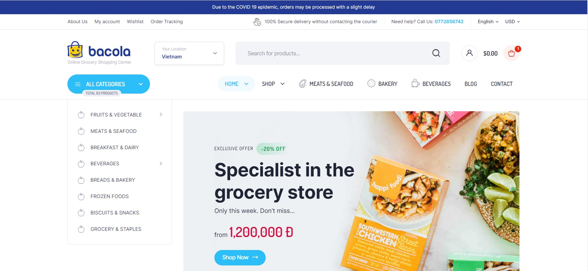
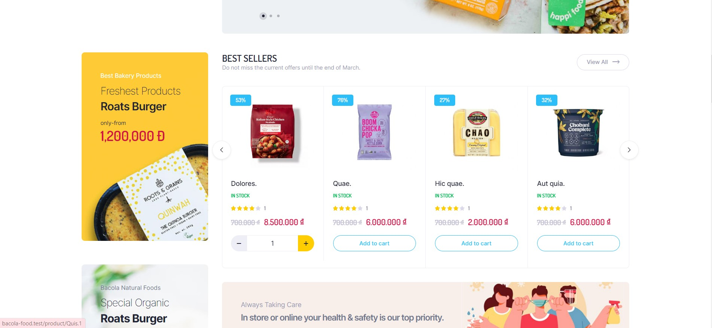
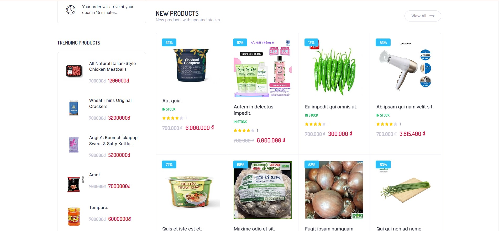
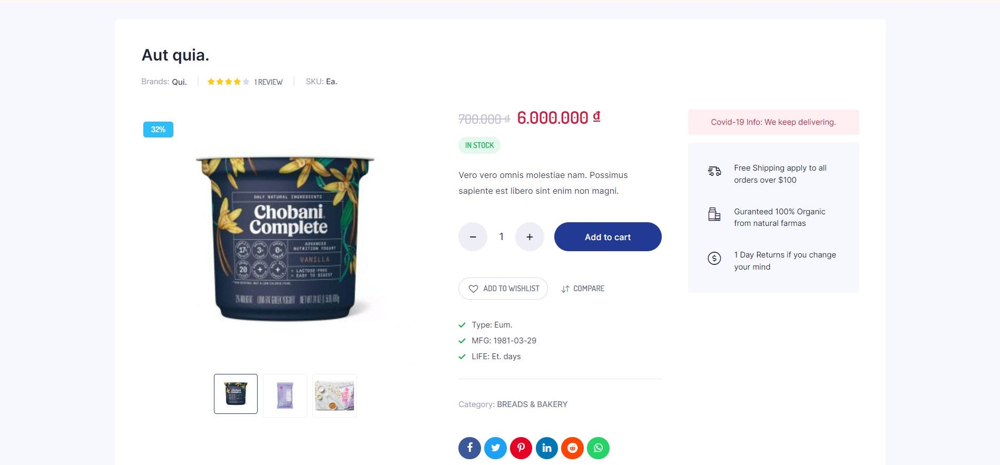
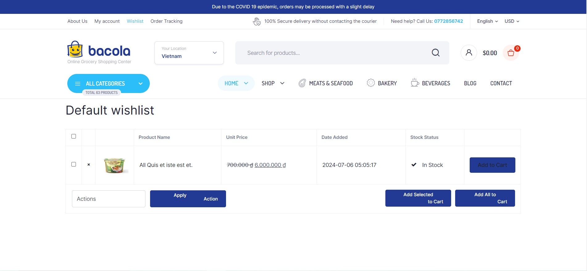
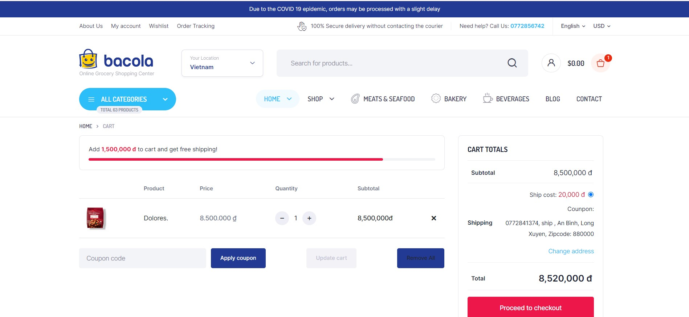
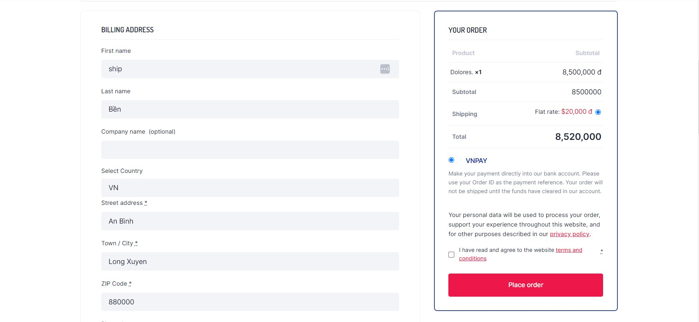

# Bacola Food.

## About this Project:

Are you looking for a reputable online grocery store with a wide variety of products, affordable prices, and home delivery? Look no further than Bacola Food! We are an online shopping website that specializes in providing fresh food products, including:
Connect with me at:

    
  &nbsp;&nbsp;
  

  📫 How to reach me: <a href='mailto:nben19732@gmail.com'>nben19732@gmail.com</a>

## Technology Used:
- Laravel
- Mysql
- Ajax/JQuery

## Features
- Login | Register
- Buy food (Edit quantity when purchasing)
- Add to card
- Search product (Filter, sort)
- Apply counpon
- Payment Online (VNPAY)
- Wishlist
 
## Screen 

